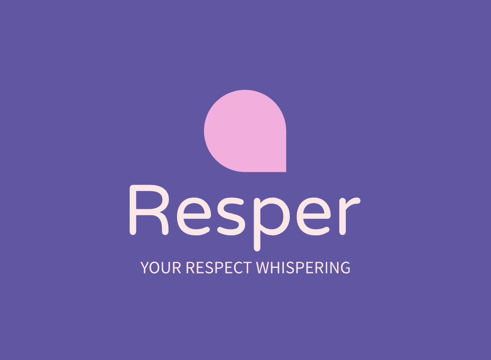

# Resper

## 競賽議題 & 子議題
- 團隊名稱：`麻木的披薩`
- 成員姓名：`楊尚叡`, `鄭皓元`, `何紫妤`, `許鈞翔`
- 競賽議題：平等起跑線：用科技打破歧視的根源
    - 子議題：消除校園歧視 X SITCON

### 專案簡介
- 用途/功能：
在打字時幫助使用者辨別是否含有「校園歧視」之字眼，清楚標示出來敏感字眼，並給予相關背景知識和提供替代說法。

- 目標客群&使用情境：
    - 學生：由於是主題是「校園歧視」，學校內的成員會是我們目標的對象。對於學生方的應用場景我們預期是在日常的社交軟體對話和學校社團等論壇發言，以及學生自發性組織活動，如營隊文案、學生政見發表、活動報告摘要。
    - 老師：由於是主題是「校園歧視」，學校內的成員會是我們目標的對象。對於老師方的應用場景我們預期是學校主管或師長要傳達公開資訊給其他師生，撰寫文案或活動時需要審視文章中的內容。例如畢業致詞、朝會文稿、活動公文、家長會導師時間。

- 操作方式：
    - 安裝 Resper 瀏覽器擴充元件
        - 安裝 Resper Chrome extension (目前是用 local 封裝的方式直接載入)
    - 使用者操作方式
        - 在任意輸入框中輸入文字
        - 若檢測到句子中包含可能構成校園歧視的詞語，將會在字詞下方顯示紅色下底線，並在左下方顯示一個 Resper 圖像的按鈕
        - 點擊左下角的按鈕後，按鈕將會展開訊息框，其中會提醒使用者此句子構成校園歧視的原因，以及建議修改方式

### 使用資源
- [Llama-3-Taiwan-8B-Instruct-Q8_0](https://huggingface.co/chienweichang/Llama-3-Taiwan-8B-Instruct-128k-GGUF)
    我們選用的 LLM 模型。
- [Next Chrome Starter](https://github.com/ibnzUK/next-chrome-starter)
    Chrome extension 的 Github template
- [AI Logo Maker](https://www.logoai.com/logo-maker)
    AI 生成 logo 的工具

### 未來展望
- 處理更大量的資料:如學生臉書社群、系學會頁面等等，管理者需要能夠審查大量文章與留言的時候
- 更多元的使用情境:目前只能在瀏覽器上使用，未來期望在其他軟體或平台也可使用

### 成果展示
- 簡報: https://reurl.cc/YExv04
> SITCON Hackathon 2024
